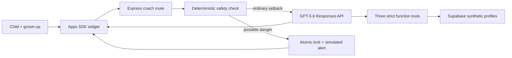

# Resilience Coach

Resilience Coach helps children practice what to try when ordinary things feel
hard—together with a grown-up. It is a short, adult-guided practice studio for
ages 6–8, built with GPT-5.6, exactly three MCP tools, an OpenAI Apps SDK
widget, and bounded synthetic continuity data in Supabase.

Built by Joshua Fisher-Keller for OpenAI Build Week 2026, Education track.

Try the live synthetic demo: <https://resilience-coach.vercel.app/>

> **Synthetic demo only.** Do not enter a real child's name, account details,
> school, location, private disclosure, or other personal data. This is an
> evidence-informed practice aid—not therapy, diagnosis, crisis care, or a
> replacement for care or a trusted adult. It may have supportive or
> therapeutic value, but this product has not been tested as an evidence-based
> intervention. Real-world use with children would require separate clinical,
> safeguarding, privacy, legal, accessibility, and Zero Data Retention review.

## Product experience

The old Sharing, Mistakes, and Change demos are now starter contexts inside one
feature: **Talk it through**. A grown-up confirms they are nearby, the child
chooses how they prefer to be supported, and the app guides one bounded loop:

**Notice → Name → Choose → Try → Check → Switch or Share**

Each practice lasts no more than six child turns—about three to five minutes.
The child can use two or three tappable choices, type a few words, say “I don't
know,” ask for simpler words, try a breath/movement/quiet/grown-up tool, or stop
at any time. The session ends with a visual **My next-time plan** card.

The five support selections are functional modes inside that shared loop:

- **Clear choices** always displays exactly two model choices.
- **Pictures + words** pairs starter and model choices with inline visual cues.
- **Move my body** provides four bounded movements and a 20-second timer.
- **Quiet pause** provides silent 20- or 40-second pauses with no audio by
  default.
- **Grown-up help** provides alternating adult and child script cards.

Support modes can be changed during practice without restarting or losing the
current conversation.

The **Grown-up view** contains only:

- skills practiced;
- the child's selected support preference;
- one short if-then next-time plan; and
- the number of completed synthetic practices.

It does not show or store a transcript. It also gives the adult a
process-praise prompt rather than a score, streak, label, or diagnosis.

Accessibility options stay locally in the browser and include read-aloud,
larger text, reduced motion, pictures plus words, movement, quiet pause, and
grown-up help. The app personalizes the form of support, never a diagnosis.

## How it works



GPT-5.6 uses the Responses API with strict function tools and a strict JSON
response format, so the widget receives a sanitized message plus zero to three
clean tappable choices. The server forces `get_child_profile` at the start and
`update_child_profile` at the end. `store: false` is set on every model request;
short-lived conversation history remains only in server memory and expires.

The supplied [`resilience_coach_system_prompt.md`](./resilience_coach_system_prompt.md)
is preserved byte-for-byte as the Build Week audit artifact. The runtime loads
it together with the versioned
[`resilience_coach_product_addendum_v3.md`](./resilience_coach_product_addendum_v3.md),
which adds the bounded loop, AI transparency, deterministic support-mode
contracts, neutral memory format, and obvious ending without silently
rewriting the original. The v2 addendum remains in the repository as version
history.

## Exact MCP surface

The public MCP contract remains exactly the three tools approved in the build
brief:

| Tool | Input | Public result | Effect |
| --- | --- | --- | --- |
| `get_child_profile` | `child_id` | `recurring_struggles`, `preferred_grounding_strategy`, `session_count` | Loads one synthetic profile at session start |
| `update_child_profile` | `child_id`, `insight` | `status`, `session_count` | Saves one bounded, non-clinical summary and keeps the newest five rows |
| `trigger_safety_handoff` | `child_id`, ISO timestamp | `status`, `locked`, `recorded_at` | Atomically records a simulated alert and locks further input |

The v2 server derives neutral structured fields from the existing `insight`
input—`practiced_strategies`, `support_preference`, and
`last_next_time_plan`—so no fourth tool or breaking public-output change was
needed. The legacy `recurring_struggles` field remains only for Build Week
contract compatibility and starter context; v2 does not use it to create new
enduring labels.

## Safety and data boundaries

A deterministic check runs before the model. Possible physical danger, abuse,
neglect, or self-harm text is not sent to GPT-5.6 and is not stored. The server
immediately locks the synthetic profile, writes a timestamped simulated alert,
and replaces the interaction with calm fixed handoff copy directing the child
to a caregiver, teacher, counselor, or another trusted adult. No SMS, email,
monitoring, emergency dispatch, or real notification is claimed or attempted.

All database access is server-side. `SUPABASE_SERVICE_ROLE_KEY` is never sent to
the browser. Row Level Security is enabled on all public tables, `anon` and
`authenticated` receive no policies or privileges, and the two write operations
are atomic Postgres functions restricted to `service_role`.

| Table | Purpose |
| --- | --- |
| `child_profiles` | Compact synthetic starter context, neutral practice memory, session count, and lock state |
| `child_profile_insights` | Newest five bounded neutral summaries; never a transcript |
| `safety_handoffs` | Simulated timestamp/status log without disclosure text |

Migrations:

- [`20260718222747_create_resilience_coach_schema.sql`](./supabase/migrations/20260718222747_create_resilience_coach_schema.sql)
- [`20260720165928_add_practice_summary_fields.sql`](./supabase/migrations/20260720165928_add_practice_summary_fields.sql)

Both target the existing Supabase project `sftdtlrrkxavklyvixoo`.

## Evidence-informed design

The v2 product decisions came from the implementation-oriented literature
review prepared July 19, 2026 and reviewed in full in this Codex task. The
research package itself is intentionally not committed to the public repository
because it contains source copies with mixed redistribution rights. The design
translation is visible in the app:

- short, repeated practice instead of an endless companion chat;
- adult co-use and process praise;
- simple choices, literal language, wait time, and a frustration exit;
- strategy-to-problem fit rather than one universal calming tool;
- an if-then next-time plan;
- support-preference and accessibility personalization rather than diagnostic
  inference;
- no streaks, disclosure rewards, dependency language, or engagement nudges;
  and
- a transcript-free adult summary with strict safeguarding boundaries.

This supports an **evidence-informed** product claim. Calling the app an
**evidence-based intervention** would require direct product evaluation. A
future evaluation should measure comprehension, successful session completion,
strategy fit, plan recall, accessibility, adult usability, safety routing, and
unintended dependency—not merely engagement time.

## Local setup

Requirements: Node.js 22, pnpm through Corepack, an OpenAI API key with GPT-5.6
access, and the server-only Supabase elevated key for project
`sftdtlrrkxavklyvixoo`.

```powershell
corepack enable
pnpm install
Copy-Item .env.example .env
```

```dotenv
OPENAI_API_KEY=...
OPENAI_MODEL=gpt-5.6
SUPABASE_URL=https://sftdtlrrkxavklyvixoo.supabase.co
SUPABASE_SECRET_KEY=...
PUBLIC_BASE_URL=http://localhost:8787
DEMO_ADMIN_TOKEN=choose-a-long-random-value
DEMO_IN_MEMORY=0
```

Never commit `.env` and never expose the Supabase elevated key to the widget.

```powershell
pnpm check
pnpm dev
```

Open <http://localhost:8787/> or <http://localhost:8787/demo>. Legacy links
such as `/demo/demo-mistakes` still work, but all three starter contexts now
render the same unified experience.

To restore the three synthetic profiles to their seeded, unlocked state:

```powershell
pnpm demo:reset
```

## Deploy and connect

The repository is public at
[`joshuafisherkeller/resilience-coach`](https://github.com/joshuafisherkeller/resilience-coach)
and is connected to Vercel. Production needs these server-only variables:

- `OPENAI_API_KEY`
- `OPENAI_MODEL=gpt-5.6`
- `SUPABASE_URL=https://sftdtlrrkxavklyvixoo.supabase.co`
- `SUPABASE_SECRET_KEY` (preferred) or the existing
  `SUPABASE_SERVICE_ROLE_KEY`
- `PUBLIC_BASE_URL=https://resilience-coach.vercel.app`
- `DEMO_ADMIN_TOKEN`
- `DEMO_IN_MEMORY=0`

The ChatGPT App connects to
`https://resilience-coach.vercel.app/mcp` as a Streamable HTTP MCP endpoint.
The Apps SDK resource is `ui://resilience-coach/coach.html` with MIME type
`text/html;profile=mcp-app`.

The installable Codex plugin lives in [`plugins/resilience-coach`](./plugins/resilience-coach).

```powershell
codex plugin marketplace add joshuafisherkeller/resilience-coach --ref main
codex plugin add resilience-coach@resilience-coach-build-week
```

## Verification

```powershell
pnpm check
pnpm build
```

Release verification covers:

- the fixed prompt hash;
- the exact three-tool MCP surface;
- strict structured coach turns with up to three choices;
- required profile load and end-of-session save;
- the automatic six-turn ceiling and next-time plan summary;
- five-row/field caps and clinical-label rejection;
- deterministic safety bypass, atomic lock, and simulated alert;
- RLS/privilege advisors and remote database queries;
- the unified browser flow, accessibility controls, grown-up view, API boundary,
  and deployed response; and
- `store: false`, explicit prompt caching, and the GPT-5.6 safety identifier.

## Build Week provenance and Codex collaboration

This project was created during the July 13–21, 2026 submission window. The
public Git history records the boundary:

| Commit | Timestamp (EDT) | Meaning |
| --- | --- | --- |
| `2cc0ce55a8d42850c8ffb3ba41c2de5c756e1eb4` | 2026-07-18 17:38:48 −04:00 | Clean Build Week baseline containing only the supplied brief and fixed prompt |
| `350279e85635eb92e232a8397b84612fda9557b1` | 2026-07-18 19:11:23 −04:00 | Initial schema, MCP server, GPT-5.6 coach, safety flow, widget, plugin, and tests |

Joshua made the product and pedagogical decisions: target ages, adult-guided
scope, synthetic-data boundary, fixed prompt, Supabase project, safety boundary,
and approval of the evidence-informed v2 direction. Codex translated those
decisions into the schema, exact tool implementation, structured GPT-5.6 flow,
widget, safety controls, tests, migration, deployment, and timestamped audit
trail. The original prompt SHA-256 remains
`78cf0d7a3f6c9a149a3e91e0105656ea5b19cec7d69ced2dcd43e9c320745f51`.

### Required Codex feedback record

- Primary build task ID: `019f771b-97a6-7f21-a34b-59a904d7ae84`
- `/feedback` Session ID: `019f771b-97a6-7f21-a34b-59a904d7ae84`

## Known limits

- Synthetic profiles only; no authentication or real child accounts.
- Simulated adult notification only.
- Keyword safety detection is conservative and not a production safeguarding
  system.
- In-memory conversation history is demo-scale and can be lost on a cold
  serverless instance; bounded profile/lock state is durable in Supabase.
- A real product needs co-design with children, caregivers, educators,
  accessibility specialists, safeguarding professionals, and independent
  clinical/privacy/legal review.

## License

[MIT](./LICENSE)
