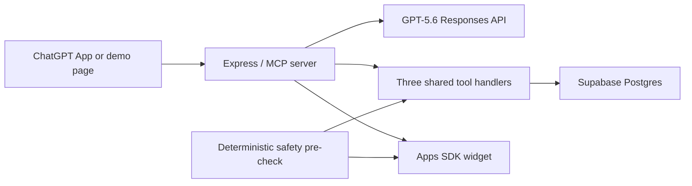

# Resilience Coach

Resilience Coach is a short social-emotional learning practice companion for ages 6–8, designed for use with an adult nearby. It combines a GPT-5.6 conversation, exactly three MCP tools, an OpenAI Apps SDK widget, and synthetic continuity data in Supabase.

Built by Joshua Fisher-Keller for OpenAI Build Week 2026, Education track.

> **Synthetic demo only.** No real children's names, accounts, contact details, disclosures, or other personal data belong in this app. It is a practice aid, not therapy, diagnosis, crisis care, or a substitute for a trusted adult. Production use involving children under 13 would require a separate privacy, legal, and Zero Data Retention review.

## Product flow

The child chooses one of three synthetic profiles, describes a small setback, receives brief validation and choice-based scaffolding, tries a grounding strategy, and ends when ready. At the explicit end, one short non-clinical insight is saved so the next session can remember what helped.

Any detected mention of physical danger, abuse, neglect, or self-harm bypasses the model, records a safety handoff, locks the profile, and replaces chat input with **“Let's find a grown-up together.”** The adult notification is deliberately simulated in the server log; no SMS or email is sent.



## What is implemented

- A stateless Streamable HTTP MCP endpoint at `/mcp`, exposing exactly `get_child_profile`, `update_child_profile`, and `trigger_safety_handoff`.
- An Apps SDK resource at `ui://resilience-coach/coach.html` using `text/html;profile=mcp-app`.
- A warm, high-contrast, large-text widget with tappable choices, sanitized model text, and a distinct locked state.
- GPT-5.6 through the Responses API with the fixed [`resilience_coach_system_prompt.md`](./resilience_coach_system_prompt.md), strict function schemas, forced profile loading on the first model round, and forced profile updating at an explicit session end.
- `store: false`, no model-managed conversation persistence, and an explicit no-breakpoint prompt-cache mode. Short-lived conversation history stays in server memory for at most one hour.
- A deterministic safety check before any model call. The triggering message is neither sent to the model nor written to Supabase.
- Atomic Postgres functions for profile updates and safety lock + alert recording.
- Three seeded synthetic profiles: `demo-sharing`, `demo-mistakes`, and `demo-change`.
- A Codex plugin manifest, a guarded `$resilience-coach` skill, and a repo marketplace entry.
- A Vercel Express adapter configured for `iad1`, close to the existing Supabase project in `us-east-1`.

## MCP contracts

| Tool | Input | Public result | Persistent effect |
| --- | --- | --- | --- |
| `get_child_profile` | `child_id` | `recurring_struggles`, `preferred_grounding_strategy`, `session_count` | None |
| `update_child_profile` | `child_id`, `insight` | `status`, `session_count` | Atomically appends the insight, keeps the newest five, merges simple patterns, and increments the session count |
| `trigger_safety_handoff` | `child_id`, ISO 8601 `timestamp` | `status`, `locked`, `recorded_at` | Atomically writes a simulated alert and locks further input |

Widget-only lock metadata is returned in MCP `_meta`, outside the approved public profile result.

## Data model

The approved migration is [`supabase/migrations/20260718222747_create_resilience_coach_schema.sql`](./supabase/migrations/20260718222747_create_resilience_coach_schema.sql). It has already been applied to Supabase project `sftdtlrrkxavklyvixoo`.

| Table | Important columns | Purpose |
| --- | --- | --- |
| `child_profiles` | `child_id`, `recurring_struggles text[]`, `preferred_grounding_strategy`, `session_count`, `locked`, `locked_at`, `is_synthetic` | Current compact synthetic profile and widget lock |
| `child_profile_insights` | `id`, `child_id`, `insight`, `created_at` | Newest five brief non-clinical insights |
| `safety_handoffs` | `id`, `child_id`, `requested_at`, `recorded_at`, `notification_mode`, `notification_status` | Demoable safety alert log without raw disclosure text |

Row Level Security is enabled on all three tables. There are intentionally no `anon` or `authenticated` policies; only the server-side Supabase `service_role` can access them. Database checks enforce synthetic-only profiles, bounded strings, valid lock timestamps, and the five-item struggle cap.

## Local setup

Requirements: Node.js 22+, pnpm through Corepack, an OpenAI API key with GPT-5.6 access, and the server-only Supabase `service_role` key for project `sftdtlrrkxavklyvixoo`.

```powershell
corepack enable
pnpm install
Copy-Item .env.example .env
```

Fill in `.env` locally. Never commit it and never expose `SUPABASE_SERVICE_ROLE_KEY` to the widget or browser.

```dotenv
OPENAI_API_KEY=...
SUPABASE_URL=https://sftdtlrrkxavklyvixoo.supabase.co
SUPABASE_SERVICE_ROLE_KEY=...
PUBLIC_BASE_URL=http://localhost:8787
DEMO_ADMIN_TOKEN=choose-a-long-random-value
DEMO_IN_MEMORY=0
```

Then run:

```powershell
pnpm check
pnpm dev
```

Open `http://localhost:8787`, or inspect `http://localhost:8787/health`. `DEMO_IN_MEMORY=1` exists only for offline tests and must not be used for a hosted build.

To restore the three profiles to their seeded, unlocked state:

```powershell
pnpm demo:reset
```

## Deploy to Vercel

Import [`joshuafisherkeller/resilience-coach`](https://github.com/joshuafisherkeller/resilience-coach) into Vercel. Set these server-only environment variables in the Vercel project settings for Production and Preview:

- `OPENAI_API_KEY`
- `SUPABASE_SERVICE_ROLE_KEY`
- `SUPABASE_URL=https://sftdtlrrkxavklyvixoo.supabase.co`
- `PUBLIC_BASE_URL=https://<your-production-domain>` (Production only; Preview can use Vercel's automatic `VERCEL_URL`)
- `OPENAI_MODEL=gpt-5.6`
- `DEMO_ADMIN_TOKEN=<long-random-value>`
- `DEMO_IN_MEMORY=0`

Do not place secrets in `vercel.json`. After deployment, verify `/health`, the three `/demo/<profile>` pages, `/mcp`, a happy-path session, and a safety-trigger session. ChatGPT requires a public HTTPS MCP endpoint.

The Vercel function is intentionally demo-scale. Conversation state is ephemeral and may be lost across a cold instance; durable profile continuity and lock state remain in Supabase.

## Connect the ChatGPT App

1. Enable Developer mode in ChatGPT under **Settings → Security and login**.
2. Open **Settings → Plugins**, select **+**, and create a developer-mode app using `https://<your-production-domain>/mcp` as the Streamable HTTP MCP URL.
3. Start a new chat, select the app, and ask: “Start Resilience Coach with the sharing demo.”
4. Confirm the widget renders, then test “I'm done for now” and verify the session count increases.
5. Reset the demo, then use a clearly synthetic danger phrase to verify the lock screen and simulated alert log.

## Install the Codex plugin

The repository contains a plugin at [`plugins/resilience-coach`](./plugins/resilience-coach) and a repo marketplace at [`.agents/plugins/marketplace.json`](./.agents/plugins/marketplace.json).

From a current Codex CLI:

```powershell
codex plugin marketplace add joshuafisherkeller/resilience-coach --ref main
codex plugin add resilience-coach@resilience-coach-build-week
```

Restart Codex or the ChatGPT desktop app and test the installed skill in a new task. Until the hosted MCP URL is added to the plugin's `.mcp.json`, the skill correctly reports that its MCP tools are not configured; it never imitates a successful tool call.

## Verification

```powershell
pnpm check
pnpm build
```

The automated suite verifies the fixed prompt hash, exact three-tool MCP surface, public-result versus widget-metadata separation, five-insight cap, locked state, safety pre-check, required start/end tool calls, no Responses storage, disabled implicit prompt-cache reuse, choice extraction, and Apps SDK widget MIME type.

The remote database was also tested inside a rolled-back transaction: six profile updates retained five insights and a safety handoff atomically wrote the alert plus lock. The database returned to its three-profile, zero-alert seed state afterward.

Credentialed end-to-end verification against the deployed GPT-5.6 route is the final release gate; it cannot run safely until the two server secrets are configured.

## Build Week provenance and Codex collaboration

This is a new project built during the July 13–21, 2026 submission window. The public Git history records the boundary:

| Commit | Timestamp (EDT) | Meaning |
| --- | --- | --- |
| `2cc0ce55a8d42850c8ffb3ba41c2de5c756e1eb4` | 2026-07-18 17:38:48 −04:00 | Clean Build Week baseline containing only the supplied brief and fixed prompt |
| `350279e85635eb92e232a8397b84612fda9557b1` | 2026-07-18 19:11:23 −04:00 | Core schema, MCP server, GPT-5.6 coach, safety flow, widget, plugin, and tests |

Joshua made the product and pedagogical decisions: Education track, target ages, adult-supervised synthetic-data scope, Supabase project, exact fixed system prompt, safety boundary, and approval of the schema and architecture. Codex translated the brief into the schema and architecture proposal, implemented the approved server/widget/plugin, applied and transaction-tested the migration, added security constraints, wrote automated tests, and maintained the audit trail. The pedagogical prompt was never rewritten; its SHA-256 remains `78cf0d7a3f6c9a149a3e91e0105656ea5b19cec7d69ced2dcd43e9c320745f51`.

GPT-5.6 is not used as a generic chat wrapper. The fixed system prompt drives short Socratic resilience scaffolding, the server forces the model to load synthetic continuity before coaching and to save one insight at explicit completion, and strict function calls make the safety and memory effects real. A deterministic safety layer remains in front of the model.

### Required Codex feedback record

- Primary build task ID recorded by Codex desktop: `019f771b-97a6-7f21-a34b-59a904d7ae84`
- `/feedback` Session ID required for submission: **PENDING — run `/feedback` in this primary build task and replace this line with the returned Session ID before submitting.**

## Known limits

- Synthetic profiles only; no authentication or real child accounts.
- Simulated adult notification only—no email, SMS, emergency dispatch, or monitoring.
- Keyword safety detection is intentionally conservative and is not a production safeguarding system.
- In-memory conversation history is demo-scale; Supabase profile and lock state are durable.
- The hosted MCP URL and credentialed live checks remain a release gate until deployment secrets are configured.

## License

[MIT](./LICENSE)
